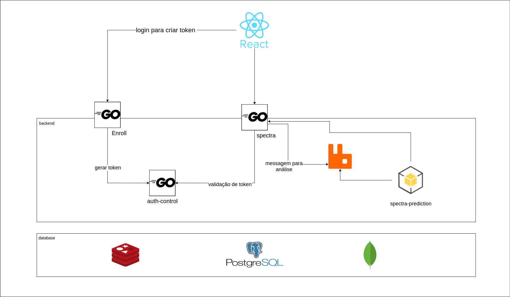

# Go - Microsserviços

Microsserviços em Go para estudo da linguagem

## Descrição
Trata-se de uma aplicação para análises de dados espectrais, oriundos da tecnologia NIRS, utilizando aprendizado de máquina para classificaçao dos espectros.

#### Arquitetura

